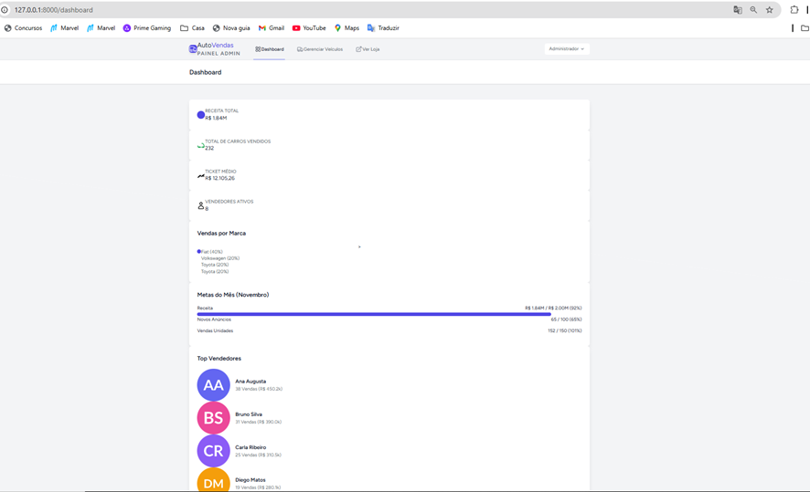

 Passo A Passo: 

1. Clone o repositório
        Link: https://github.com/LucasS352/laravel-vendas-carros.git

2. composer install

3. npm install` && `npm run build`

4. Crie o arquivo .env (`.env.example .env`) e configure o banco.

        

5. Rode o comando para criar as tabelas e popular o banco com dados de teste:

  	   php artisan migrate --seed

Acesso Administrativo
- Email: admin@admin.com
- Senha: password

***********************************************************************************

AREA ADMINISTRADOR. 

Tela de registro: 
Url: 	http://127.0.0.1:8000/register

Tela de Login: 
Url: http://127.0.0.1:8000/login

Tela de Dashboard: 
Url: http://127.0.0.1:8000/dashboard     (DASHBOARDFAKE) 

Tela Gerencia de Veiculos: 
Url: http://127.0.0.1:8000/admin/veiculos

Tela Editar Veiculos:
URL: http://127.0.0.1:8000/admin/veiculos/2/edit

Cadastrar Novo Veiculo:
URL: http://127.0.0.1:8000/admin/veiculos/create

AREA CLIENTE 

Tela Vitrine:
URL: http://127.0.0.1:8000/

Filtros Funcionais: 

Ao clicar acima do nome do veiculo é possivel entrar na pagina detalhes: 

Tela Detalhes Do Veiculo 
URL: http://127.0.0.1:8000/veiculo/1

