Alunos 

Gabriel trevisan de Lima   R.A:010624006

Lucas André de souza       R.A:020124026

Passo A Passo: 

1. Clone o repositório
        Link: https://github.com/LucasS352/laravel-vendas-carros.git

2. composer install

3. npm install` && `npm run build`

4. Crie o arquivo .env (`cp .env.example .env`) e configure o banco.

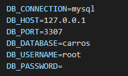

5. Abra o XAMPP, e de start no banco e no apache

   

        
6. Rode o comando para criar as tabelas e popular o banco com dados de teste:

  	   php artisan migrate --seed

7. Depois acesse o a URL: (http://127.0.0.1:8000/)   - Ira abrir a vitrine da loja
 

Acesso Administrativo
- Email: admin@admin.com
- Senha: password

***********************************************************************************

AREA ADMINISTRADOR. 

Tela de registro: 
Url: 	http://127.0.0.1:8000/register

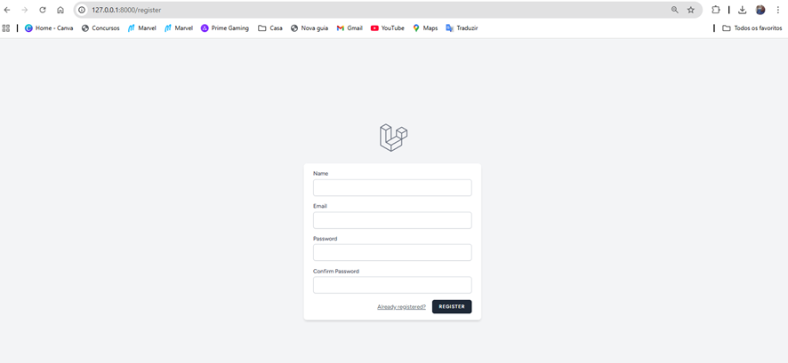

Tela de Login: 
Url: http://127.0.0.1:8000/login

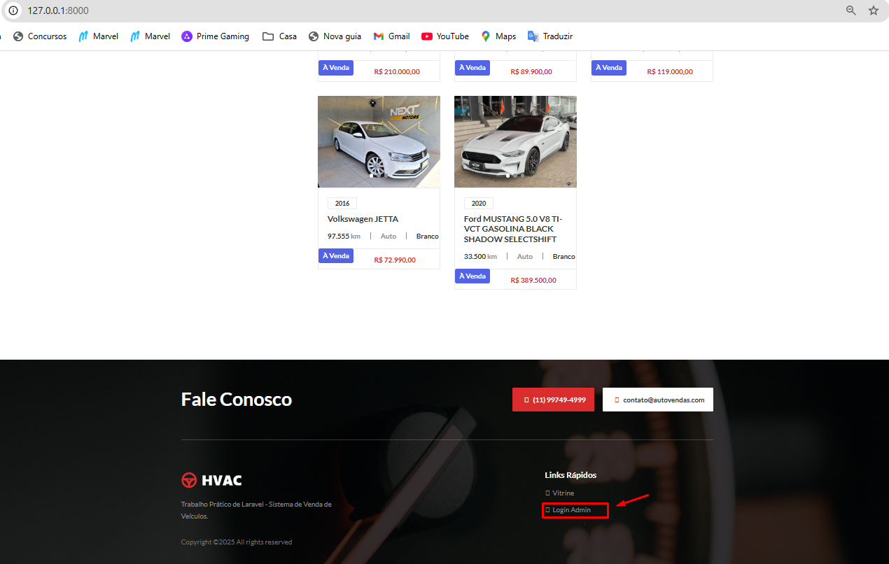
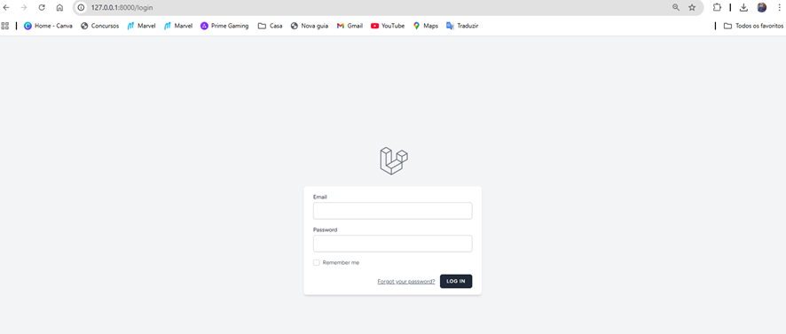

Tela de Dashboard: 
Url: http://127.0.0.1:8000/dashboard     (DASHBOARDFAKE) 

Tela Gerencia de Veiculos: 
Url: http://127.0.0.1:8000/admin/veiculos

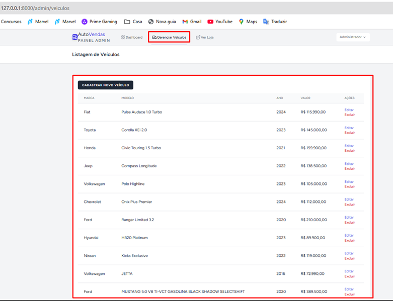

Tela Editar Veiculos:
URL: http://127.0.0.1:8000/admin/veiculos/2/edit

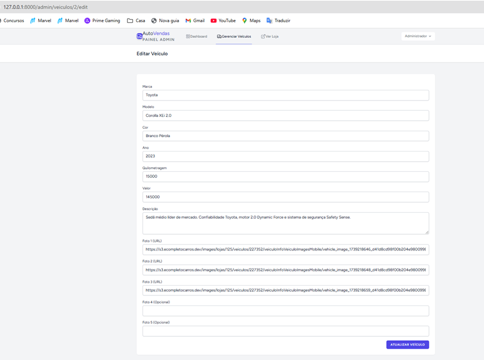

Cadastrar Novo Veiculo:
URL: http://127.0.0.1:8000/admin/veiculos/create

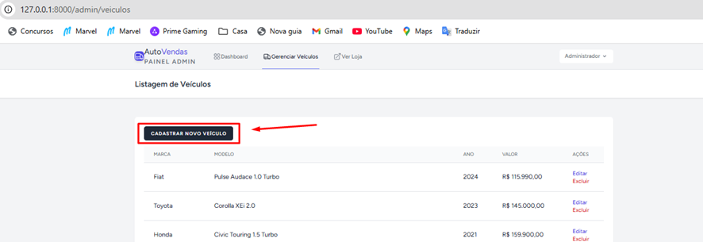
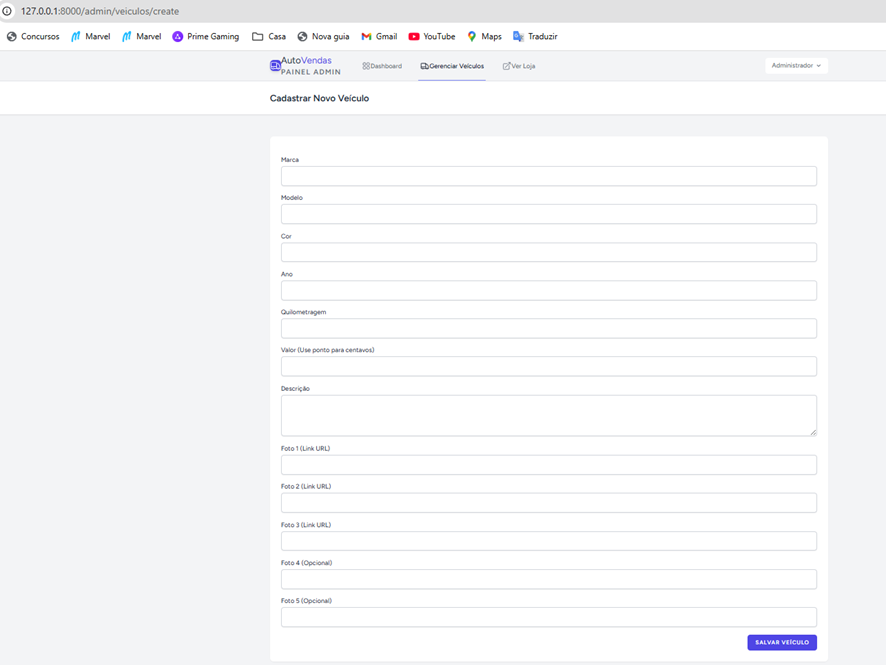

AREA CLIENTE 

Tela Vitrine:
URL: http://127.0.0.1:8000/

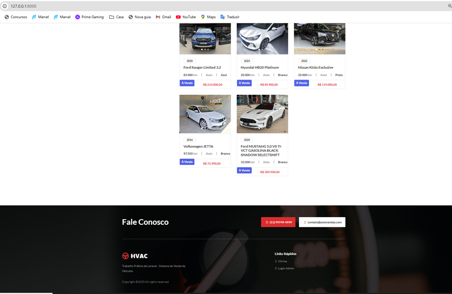

Filtros Funcionais: 
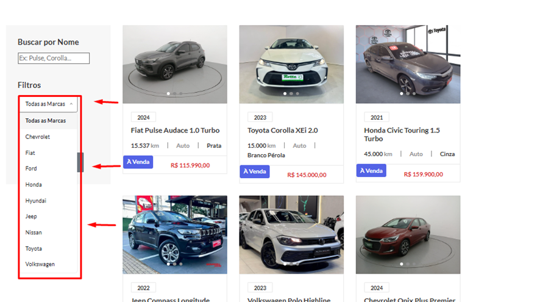

Ao clicar acima do nome do veiculo é possivel entrar na pagina detalhes: 

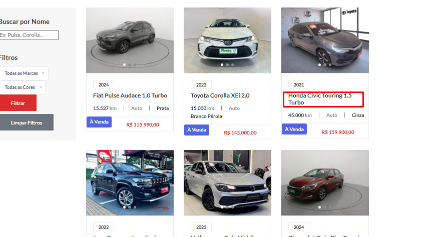

Tela Detalhes Do Veiculo 
URL: http://127.0.0.1:8000/veiculo/1

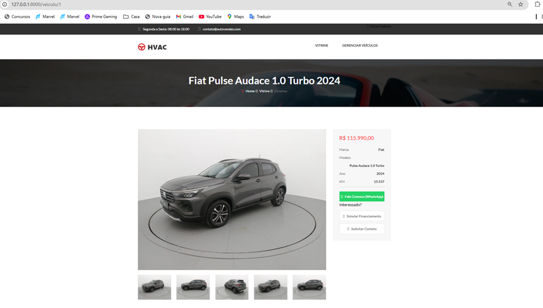

