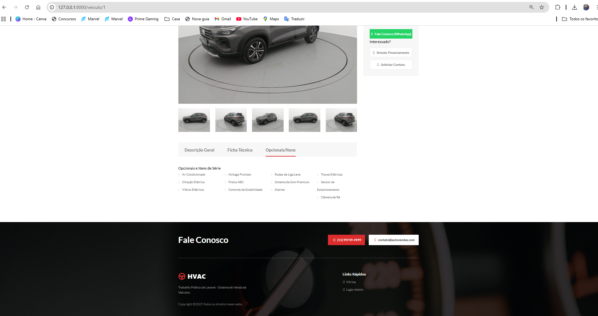

 Instalação

1. Clone o repositório
2. composer install
3. npm install` && `npm run build`
4. Crie o arquivo .env (`cp .env.example .env`) e configure o banco.
5. Rode o comando para criar as tabelas e popular o banco com dados de teste:
  	   php artisan migrate --seed

Acesso Administrativo
- Email: admin@admin.com
- Senha: password

